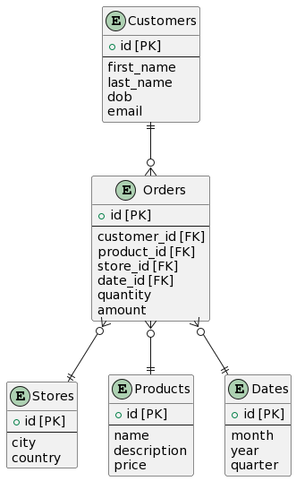
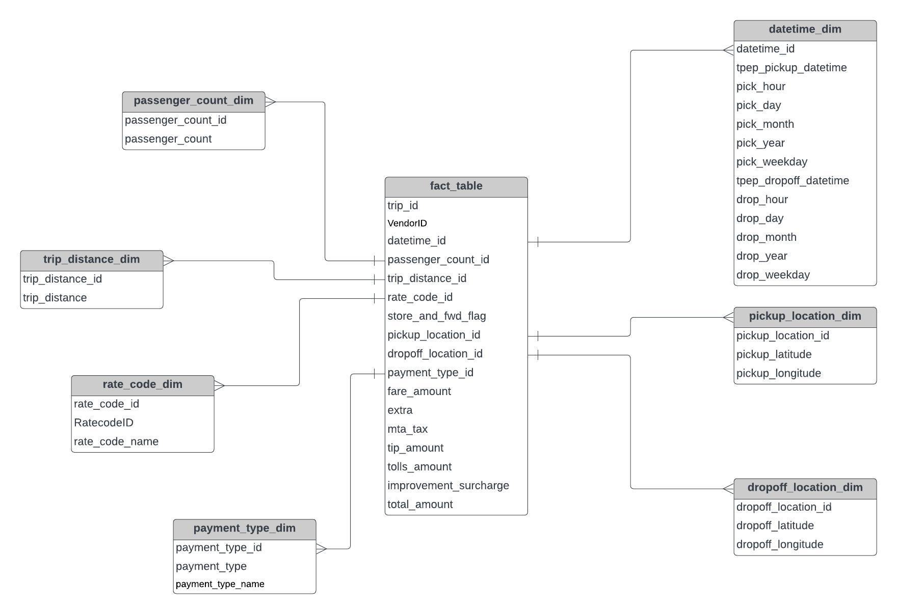
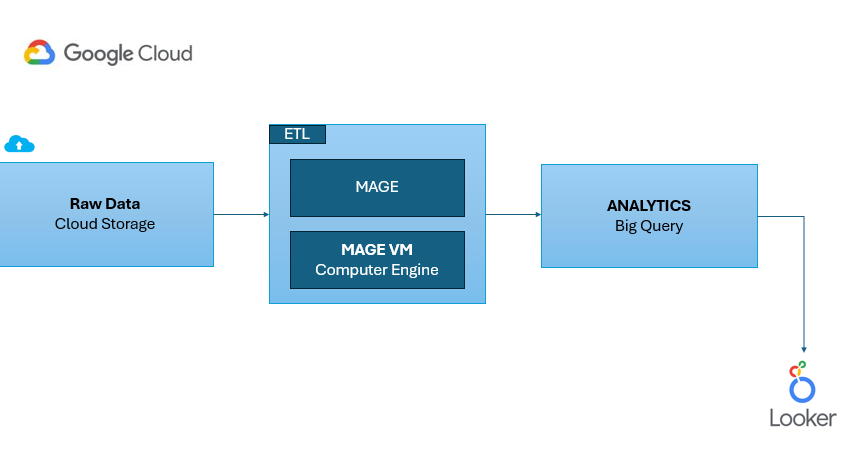

# Uber Dataset Analytics on Google Cloud

This repository contains the code and resources for working with Uber dataset for data analytics on Google Cloud Platform.

## Overview

The project involves various stages including data storage, ETL (Extract, Transform, Load) processes, analytics using BigQuery, and building dashboards with Looker.

## Fact & Dimension Table

### Fact Table

- Contains quantitative measures or metrics that are used for analysis
- Typically contains foreign keys that link to dimension tables
- Contains columns that have high cardinality and change frequently
- Contains columns that are not useful for analysis by themselves, but are necessary for calculating metrics

### Dimension Table

- Contains columns that describe attributes of the data being analyzed
- Typically contains primary keys that link to fact tables
- Contains columns that have low cardinality and don't change frequently
- Contains columns that can be used for grouping or filtering data for analysis

## Representation diagram of Fact and Dimension Table

## Workflow

1. **Data Storage through Cloud**: Utilizing Google Cloud Storage for storing the dataset.
2. **ETL**: Employing MergeMV and Compute Engine for ETL processes.
   **Marge**: An open source data pipeline tool for transforming and integrating data. It is like **Airflow**.
3. **Analytics/BigQuery**: Performing analytics using BigQuery for insights.
4. **Looker**: Building dashboards for visualization and exploration.

## Technology Used

- **Programming Language**: Python
- **Google Cloud Platform Services**:

  - Google Storage
  - Compute Engine
  - BigQuery
  - Looker Studio

  ## Architecture

## Resources

- **Dataset**: The dataset used in this project is available [here](https://www.nyc.gov/site/tlc/about/tlc-trip-record-data.page).

- **Data Dictionary**: The data Dictionary of dataset used used in this project [here](https://data.cityofnewyork.us/Transportation/2021-Yellow-Taxi-Trip-Data/m6nq-qud6/about_data).

- **Addictional Data**: For further information, refer to the [NYC TLC Trip Record Data](https://www.nyc.gov/site/tlc/about/tlc-trip-record-data.page) and its [Data Dictionary](https://www.nyc.gov/assets/tlc/downloads/pdf/data_dictionary_trip_records_yellow.pdf).

## Understanding GCP Services

To understand the Google Cloud Platform services utilized in this project, refer to the following:

- Cloud Storage
- Compute Engine
- BigQuery
- Looker

## Contact

For any inquiries or feedback, feel free to reach out to [ericmaniraguha@gmail.com](mailto:your_email@example.com).

---
